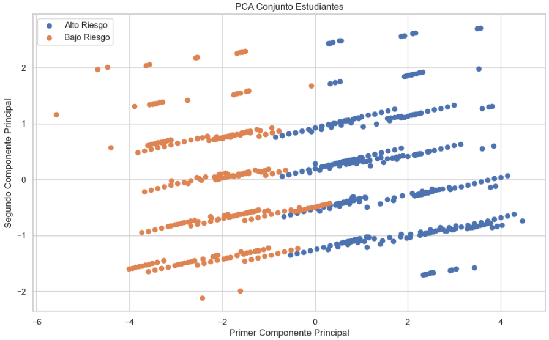

# Proyecto ML : La adicción de los estudiantes a las redes sociales

Este proyecto analiza el impacto de la adicción a las redes sociales en el bienestar y rendimiento de estudiantes con un rango de edad de 14 a 24 años. El estudio abarca diversos niveles educativos, incluyendo estudiantes de secundaria (High School), estudiantes universitarios (Undergraduates) y graduados. Utilizando un dataset con registros de múltiples países, se investiga cómo el tiempo de uso diario y el tipo de plataforma afectan tanto la salud mental como el desempeño en sus respectivos niveles de formación académica.

📊 Dataset Overview (Columnas Principales):

- Variable Objetivo (Target): Affects_Academic_Performance — Indica si el estudiante percibe un impacto negativo en sus estudios (Valores: "Yes" / "No").

- Variables Demográficas: Age (rango 14-24 años), Gender ("Male" / "Female"), Academic_Level e ID.

- Uso de Redes: Avg_Daily_Usage_Hours y Most_Used_Platform (Instagram, TikTok, etc.).

- Bienestar: Sleep_Hours_Per_Night y Mental_Health_Score (Escala 1-10).

- Adicción y Social: Addicted_Score y Conflicts_Over_Social_Media.

## Tech Stack

**Client:** Core Libraries

**Server:** Environment

**Lenguaje:** Python 3.13.7

**Bibliotecas de Análisis:** Pandas, NumPy

**Modelado Predictivo:** Scikit-Learn (Random Forest, Regresión Logística, Árboles de Decisión)

**Aprendizaje No Supervisado:** KMeans, PCA, SVD, Clustering Jerárquico

**Visualización:** Seaborn, Matplotlib

## Roadmap

- EDA (Pandas,Matplotlib,Seaborn,Numpy)
- Aprendizaje Supervizado (ML)
- Aprendizaje No Supervizado (ML)
- Mini Proyecto Final

### 📊 Visualizaciones del Análisis

#### 🧠 Reducción de Dimensionalidad e Insights

*Aplicación de PCA para identificar los componentes principales que explican la varianza en la adicción de los estudiantes.*

#### 🤖 Modelado Predictivo

*Resultados del modelo de Regresión Logística mostrando la precisión en la predicción del impacto académico.*

#### 📌 Agrupamiento (Clustering)

*Segmentación de estudiantes mediante K-Means para identificar patrones y grupos de riesgo.*

## Lessons Learned

- **Manejo de Datos Complejos:** Aprendí a estructurar un flujo de trabajo con más de 500 celdas de código, manteniendo el orden mediante secciones claras.

- **Versatilidad de Algoritmos:** Implementé tanto aprendizaje supervisado para predicción como no supervisado (KMeans, PCA, SVD) para descubrir patrones ocultos en la adicción a redes

- **Importancia del Contexto:** Entendí que variables sociales como la salud mental y los conflictos interpersonales son predictores clave del éxito académico

## Authors

- **Autor del Dataset:** [Adil Shamim](https://www.kaggle.com/adilshamim8)

- **Análisis y Modelado de ML:** [MLbyMatias](https://github.com/MLbyMatias) 
## License

Este proyecto está bajo la Licencia MIT.

El dataset utilizado en este proyecto tiene una licencia Creative Commons Attribution 4.0 International (CC BY 4.0), propiedad de Adil Shamim.

## Documentation

[Archivo CSV](https://www.kaggle.com/datasets/adilshamim8/social-media-addiction-vs-relationships)
